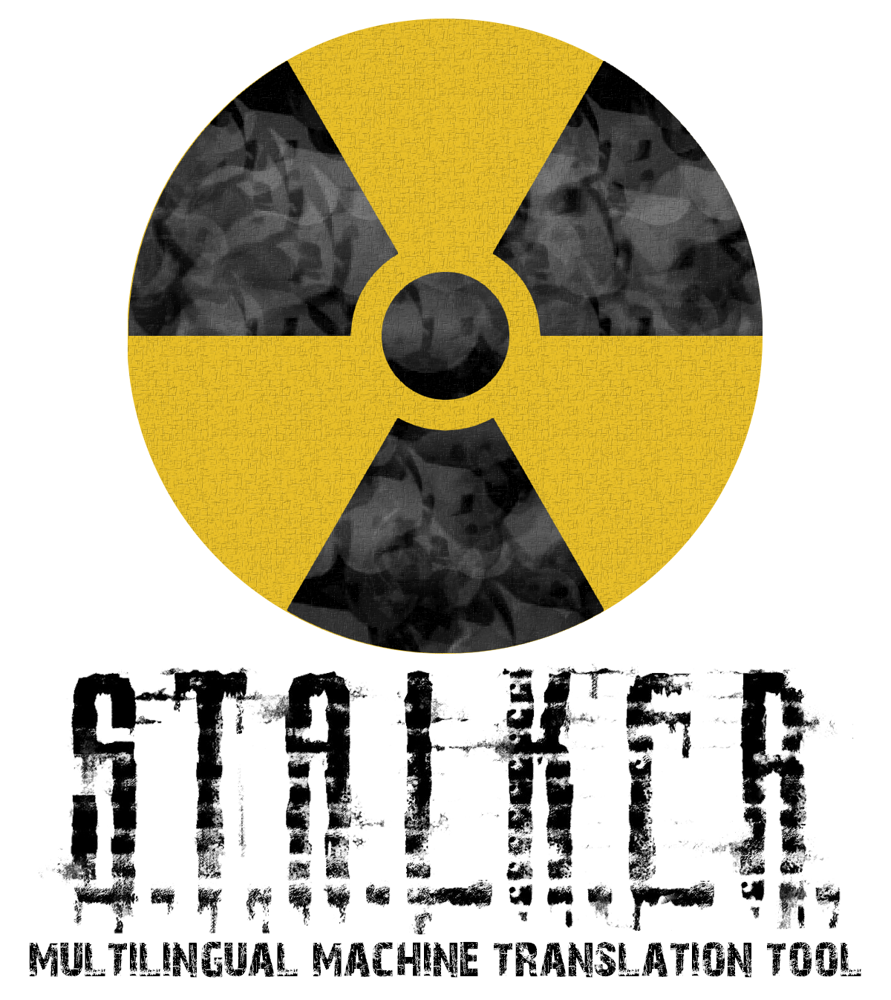

- [English](readme.md#english)
- [Українська](readme.md#Українська)
- [Русский](readme.md#русский)
- [Français](readme.md#francais)

# __ENGLISH__

## INFORMATIONS

This is an automatic translation tool designed for mods of the S.T.A.L.K.E.R franchise.
 

When you enter the path of the folder you want to translate, the script will recreate this folder by translating the XML files. If a `localization.ltx` file exists, the XML files will be automatically reorganized.
 

The translation is performed using Argostranslate, an AI that installs locally on your machine. The AI is lightweight and can easily run on any machine.
 

The translation is not and never will be perfect and therefore contains errors. What's more, only XML files are translated.
 

There are plans to add features to perfect the translation and translate other files.
 

Please let me know of any problems.
 

## INSTALLATION GUIDE

1.
    - Download the project as a zip file
    - or make a git clone

2. Run the multilingual-machine-translation-tool.bat file

If this is your first time running the file, it will need to install the Python environment and Argostranslate.

## PROBLEMS?

**How can I uninstall the tool from my machine?**

An uninstallation file is located in the `uninstall` folder. Make sure to run this file before deleting the `STALKER-multilingual-machine-translation-tool` folder.

**Other**

If you have any problems, please feel free to send me a private message.

# __Українська__

## ІНФОРМАЦІЯ

Це інструмент автоматичного перекладу, розроблений для модів франшизи S.T.A.L.K.E.R.
 

Коли ви вводите шлях до папки, яку хочете перекласти, скрипт відтворює цю папку, перекладаючи XML-файли. Якщо існує файл `localization.ltx`, XML-файли будуть автоматично реорганізовані.
 

Переклад виконується за допомогою Argostranslate, штучного інтелекту, який встановлюється локально на вашому комп'ютері. ШІ є легким і може легко працювати на будь-якому комп'ютері.
 

Переклад не є і ніколи не буде ідеальним; він містить помилки. Крім того, перекладаються лише файли XML.
 

Планується додати функції для вдосконалення перекладу та перекладу інших типів файлів.
 

Будь ласка, повідомляйте мені про будь-які проблеми.
 

## ІНСТРУКЦІЯ З ВСТАНОВЛЕННЯ

1.
    - Завантажте проект у вигляді zip-файлу
    - або виконайте git clone

2. Запустіть файл multilingual-machine-translation-tool.bat

Якщо це ваш перший запуск файлу, йому потрібно буде встановити середовище Python та Argostranslate.

## ПРОБЛЕМИ?

**Як я можу видалити інструмент з мого комп'ютера?**

Файл для видалення знаходиться в папці `uninstall`. Переконайтеся, що ви запустили цей файл перед видаленням папки `STALKER-multilingual-machine-translation-tool`.

**Інші проблеми**

Якщо у вас виникли будь-які проблеми, будь ласка, напишіть мені в особисті повідомлення.

# __РУССКИЙ__

## ИНФОРМАЦИЯ

Это инструмент автоматического перевода, предназначенный для модов франшизы S.T.A.L.K.E.R.
 

Когда вы вводите путь к папке, которую хотите перевести, скрипт воссоздаёт эту папку, переводя XML-файлы. Если существует файл `localization.ltx`, XML-файлы будут автоматически реорганизованы.
 

Перевод выполняется с помощью Argostranslate, искусственного интеллекта, который устанавливается локально на вашем компьютере. ИИ является лёгким и может легко работать на любом компьютере.
 

Перевод не является и никогда не будет идеальным; он содержит ошибки. Кроме того, переводятся только файлы XML.
 

Планируется добавить функции для улучшения перевода и перевода других типов файлов.
 

Пожалуйста, сообщайте мне о любых проблемах.
 

## ИНСТРУКЦИЯ ПО УСТАНОВКЕ

1.
    - Скачайте проект в виде zip-файла
    - или выполните git clone

2. Запустите файл multilingual-machine-translation-tool.bat

Если это ваш первый запуск файла, ему потребуется установить среду Python и Argostranslate.

## ПРОБЛЕМЫ?

**Как я могу удалить инструмент с моего компьютера?**

Файл для удаления находится в папке `uninstall`. Убедитесь, что вы запустили этот файл перед удалением папки `STALKER-multilingual-machine-translation-tool`.

**Другие проблемы**

Если у вас есть какие-либо проблемы, пожалуйста, напишите мне в личные сообщения.

# __FRANCAIS__

## INFORMATIONS

Ceci est un outil de traduction automatique pensé pour les mods de la franchise S.T.A.L.K.E.R.
 

Lorsque vous entrer le chemin du dossier que vous voulez traduire, le script va recréer se dossier en traduisant les fichiers XML. Si un fichier localization.ltx existe, les fichiers XML seront réorganisés automatiquement.
 

La traduction se fait par le biait d'Argostranslate qui est une IA qui s'installera en locale sur votre machine. L'IA reste légère et peut facilement tourner sur n'importe quelle machine.
 

La traduction n'est et ne sera jamais parfaite et contient donc des erreurs. De plus, seul les fichiers xml sont traduits.
 

Il est prévu d'ajouter des fonctionnalitées pour perfectionner la traduction et traduire les autres fichiers.
 

N'hesitez pas à me signaler tout problèmes.
 

## GUIDE D'INSTALLATION

1.
    - Télécharger le projet en zip
    - ou faites un git clone

2.  Lancez le fichier multilingual-machine-translation-tool.bat

Le fichier si cela est votre première execution du fichier, ce dernier va devoir installer l'environement python ainsi que Argostranslate.

## PROBLEMES ?

**Comment puis-je désinstaller l'outil de ma machine ?**

un fichier de désinstallation se trouve dans le dossier unistall. assurez-vous de lancer ce fichier avant de supprimer le dossier STALKER-multilingual-machine-translation-tool.

**Autre**

Si vous rencontrez des problèmes, vous êtes le bienvenu dans mes messages privés.

# TECHNOLOGIES USED

- [Argotranslate](https://github.com/argosopentech/argos-translate)

# __CONTACTS__

